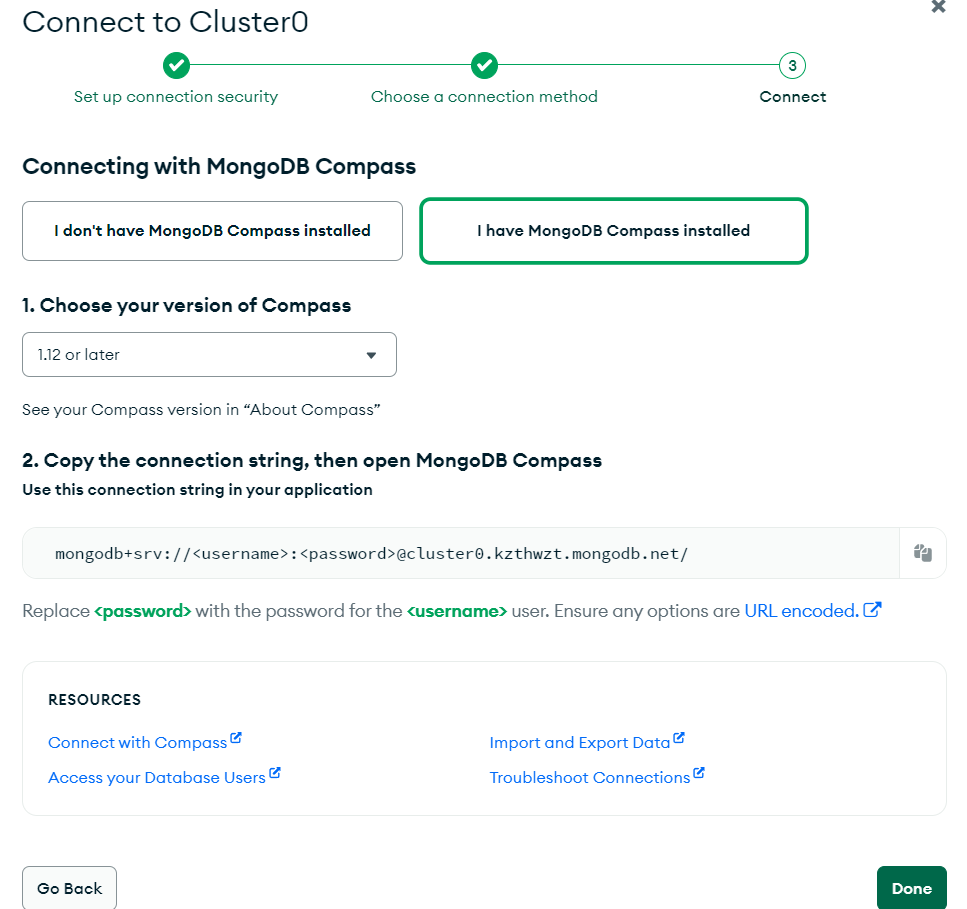

# Deploying MongoDB Cluster on Atlas

**Create a New Cluster:**

4. **Configure Access:**

5. **Whitelist IP Addresses:**

6. **Connect to the Cluster:**

7. **Verify the Setup:**

La connexion à Atlas est OK