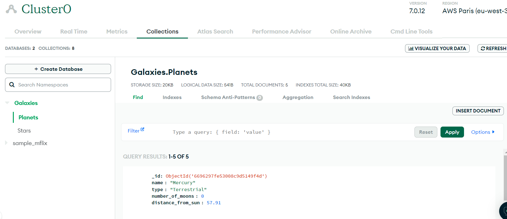

# MongoDB Setup and Management using Docker

## Objectives

Students will learn how to set up MongoDB using Docker, manage databases and collections, create backups, and restore data using terminal commands in Bash or PowerShell.


## Step 1: Pull the MongoDB Docker Image

1. From your terminal, create a new directory for your MongoDB data
ok

2. Pull the MongoDB Docker image from Docker Hub.


3. Run a MongoDB container using the image you just pulled.

4. Verify that the container is running.

```bash
docker ps
```


you should see the MongoDB container running.

## Step 2: Connect to the MongoDB Container

1. Connect to the MongoDB container to your atlas Cluster using the following command:

```bash
docker exec -it <container_id> mongosh "mongodb+srv://dcou45093:<password>@cluster0.kzthwzt.mongodb.net/" --username <username> --password <password>
```

You should now be connected to the MongoDB shell.


## Step 3: Create a Database and Collection

1. Create a new database called `Galaxies`.

2. Create a new collection called `Stars`.

3. Insert 5 new documents into the `Stars` collection.

***PS: I want to add the following caracteristics on stars***:
- Name
- Type
- Age
- Distance from Earth

4. Query the `Stars` collection to verify that the document was inserted.

5. Create a new collection called `Planets`.

6. Insert 5 new documents into the `Planets` collection.

***PS: I want to add the following caracteristics on planets***:

- Name
- Type
- Number of Moons
- Distance from the Sun

7. Create indexes on the `Name` field for both the `Stars` and `Planets` collections.



## Step 4: Backup and Restore Data

1. Create a backup of the `Galaxies` database.

2. Delete the `Galaxies` database.

3. Restore the `Galaxies` database from the backup and name it `Galaxies_Restored`.

4. Verify that the `Galaxies_Restored` database has been restored successfully.


## Step 5: Configure Role-Based Access Control

1. Create a new user with the `readWrite` role for the `Galaxies_Restored` database.

2. Connect to the `Galaxies_Restored` database using the new user credentials.

3. Insert a new document into the `Stars` collection.

4. Verify that the document was inserted successfully.


## Step 6: Write a Docker Compose File And a Shell Script

1. Write a Docker Compose file that sets up a MongoDB container with the following configurations:

- Use the latest MongoDB image from Docker Hub.
- Set the container name to `mongodb_container`.
- Expose port `27017` on the host machine.
- Mount the `./data` directory on the host machine to the `/data/db` directory in the container.

2. Write a shell script that automates the following tasks:

- Pull the MongoDB Docker image.
- Run a MongoDB container using the image you just pulled.
- Verify that the container is running.
- Connect to the MongoDB container using the `mongo` shell.
- Create a new database called `Galaxies`.
- Create a new collection called `Stars`.
- Insert 5 new documents into the `Stars` collection.
- Query the `Stars` collection to verify that the document was inserted.
- Create a new collection called `Planets`.
- Insert 5 new documents into the `Planets` collection.
- Create indexes on the `Name` field for both the `Stars` and `Planets` collections.
- Create a backup of the `Galaxies` database.

3. Run the shell script and verify that all the tasks are completed successfully.

Voir script + docker-compose